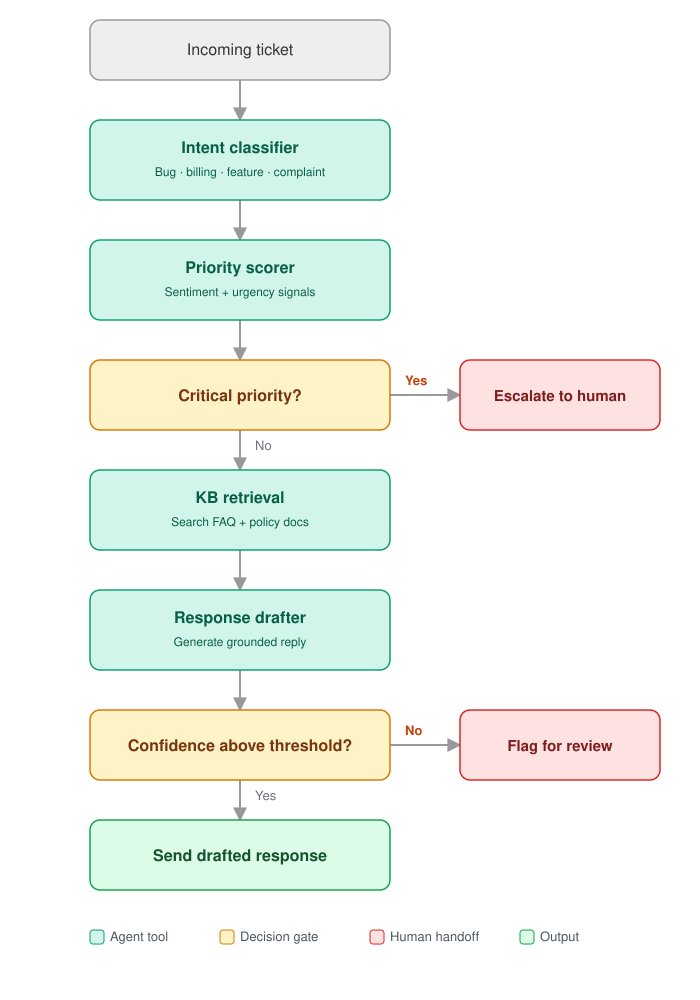

# Support Ticket Triage & Response Agent

A multi-step AI agent that automatically classifies, prioritizes, and responds to customer support tickets using LangGraph orchestration, RAG-based knowledge retrieval, and LLM-powered response generation.

## Architecture



- **Intent classifier** — categorizes as bug · billing · feature · complaint
- **Priority scorer** — sentiment + urgency signals
- **KB retrieval** — searches FAQ + policy docs
- **Response drafter** — generates a grounded reply

Each box maps directly to code:

| Diagram node               | Kind          | File                                                | Function                |
|-----------------------------|---------------|------------------------------------------------------|--------------------------|
| Incoming ticket              | input         | [`src/agent/state.py`](src/agent/state.py)           | `TicketState` (shared state passed between every node) |
| Intent classifier            | Tool 1        | [`src/tools/intent_classifier.py`](src/tools/intent_classifier.py) | `classify_intent()`      |
| Priority scorer              | Tool 2        | [`src/tools/priority_scorer.py`](src/tools/priority_scorer.py)     | `score_priority()`       |
| Critical priority? (gate)    | decision      | [`src/agent/graph.py`](src/agent/graph.py)           | `route_after_priority()` |
| Escalate to human            | handoff       | [`src/agent/graph.py`](src/agent/graph.py)           | `escalate_node()`        |
| KB retrieval                 | Tool 3        | [`src/tools/kb_retriever.py`](src/tools/kb_retriever.py) + [`src/knowledge/vector_store.py`](src/knowledge/vector_store.py) | `retrieve_from_kb()` (ChromaDB similarity search) |
| Response drafter             | Tool 4        | [`src/tools/response_drafter.py`](src/tools/response_drafter.py)   | `draft_response()`       |
| Confidence ≥ threshold? (gate) | decision    | [`src/agent/graph.py`](src/agent/graph.py)           | `route_after_draft()`    |
| Flag for review              | handoff       | [`src/agent/graph.py`](src/agent/graph.py)           | `flag_node()`            |
| Send drafted response        | output        | [`src/agent/graph.py`](src/agent/graph.py)           | `send_node()`            |

The whole pipeline is wired together as a LangGraph state machine in `build_agent_graph()` inside [`src/agent/graph.py`](src/agent/graph.py).

## Tech Stack

| Layer             | Tool                        | Why                                      |
|-------------------|-----------------------------|------------------------------------------|
| Agent framework   | LangGraph                   | State machine with conditional routing    |
| LLM orchestration | LangChain                   | Prompts, tool definitions, output parsing |
| LLM provider      | Groq (free) / OpenAI (paid) | Groq gives free Llama 3.1 70B inference   |
| Vector store      | ChromaDB                    | Local, no infra, persistent               |
| Embeddings        | sentence-transformers       | Free local embeddings (MiniLM)            |
| UI                | Streamlit                   | Fast prototyping, easy for non-coders     |
| Evaluation        | scikit-learn + custom       | Precision, recall, F1 + ablation table    |
| Language          | Python 3.10+                | Only language needed                      |

## Project Structure

```
support-agent/
├── config/
│   └── settings.py              # All config in one place (CONFIDENCE_THRESHOLD, provider, etc.)
├── data/
│   ├── raw/                     # Raw ticket datasets (Bitext, Kaggle) — populate locally
│   ├── knowledge_base/
│   │   └── billing_faq.md       # FAQ/policy docs the KB retriever searches
│   └── golden_set/
│       └── golden_qa.csv        # Ground-truth evaluation set
├── src/
│   ├── agent/
│   │   ├── graph.py             # LangGraph pipeline — wires nodes + decision gates
│   │   └── state.py             # TicketState TypedDict — shared state through the graph
│   ├── tools/
│   │   ├── intent_classifier.py # Tool 1 — classify_intent()
│   │   ├── priority_scorer.py   # Tool 2 — score_priority()
│   │   ├── kb_retriever.py      # Tool 3 — retrieve_from_kb()
│   │   └── response_drafter.py  # Tool 4 — draft_response()
│   ├── knowledge/
│   │   └── vector_store.py      # ChromaDB wrapper used by the KB retriever
│   └── evaluation/
│       └── evaluator.py         # Golden set eval + ablation runner
├── app/
│   └── streamlit_app.py         # Streamlit frontend
├── tests/                       # Unit tests (scaffolded, add as tools are implemented)
├── requirements.txt
├── .env.example
└── README.md
```

## Setup

```bash
# 1. Clone and enter
git clone <repo-url>
cd support-agent

# 2. Create virtual env
python -m venv venv
source venv/bin/activate   # Windows: venv\Scripts\activate

# 3. Install dependencies
pip install -r requirements.txt

# 4. Configure environment
cp .env.example .env
# Edit .env → add your Groq API key (free at console.groq.com)

# 5. Run the app
streamlit run app/streamlit_app.py
```

## Sprint Schedule

Gantt chart mapping every task in this README to a day and an owner: https://claude.ai/code/artifact/289922ef-e1f2-41f1-a1aa-8064d3aa2fd8

## Team Assignments

### Strong Technical Members (2-3 people)
- **Agent pipeline**: `src/agent/graph.py` — LangGraph state machine
- **Tool implementations**: All 4 files in `src/tools/`
- **Vector store**: `src/knowledge/vector_store.py` — ChromaDB + embeddings
- **Evaluation code**: `src/evaluation/evaluator.py` — metrics + ablation runner

### Other Members (2 people)
- **Knowledge base curation**: Write FAQ/policy docs in `data/knowledge_base/`
- **Golden test set**: Build 50-100 rows in `data/golden_set/golden_qa.csv`
- **Streamlit UI**: `app/streamlit_app.py` — layout and display logic
- **Prompt ablation execution**: Run experiments, record results, build comparison table
- **Documentation**: README, demo slides, final report

## Evaluation Strategy (CV Differentiator)

### Golden Test Set
50-100 support tickets with ground-truth labels for intent, priority, action, and reference response. This is what separates a real project from a toy demo.

### Ablation Table
Run 4 agent variants against the golden set and compare:

| Variant          | Intent Acc | Priority Acc | Action Acc | Response Quality |
|------------------|-----------|-------------|-----------|-----------------|
| Full agent       | —         | —           | —         | —               |
| No KB retrieval  | —         | —           | —         | —               |
| No priority gate | —         | —           | —         | —               |
| Single-shot LLM  | —         | —           | —         | —               |

This table proves each component adds value — that's what hiring managers look for.

## Data Sources
- **Ticket datasets**: Bitext customer support dataset, Kaggle support ticket classification
- **KB content**: Write your own (simulated company FAQ/policies)
